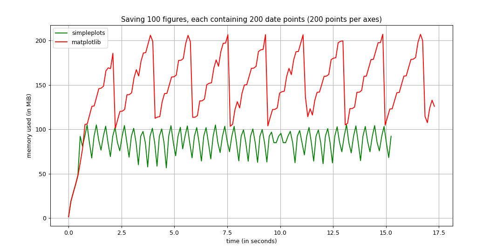
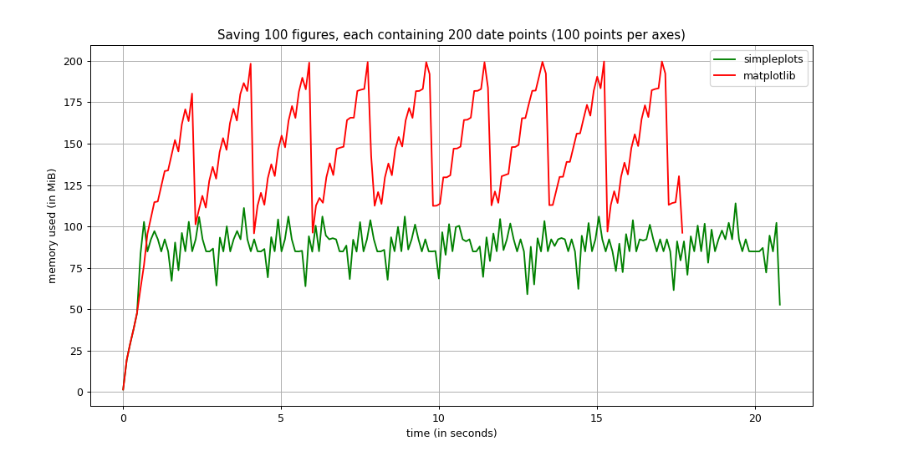
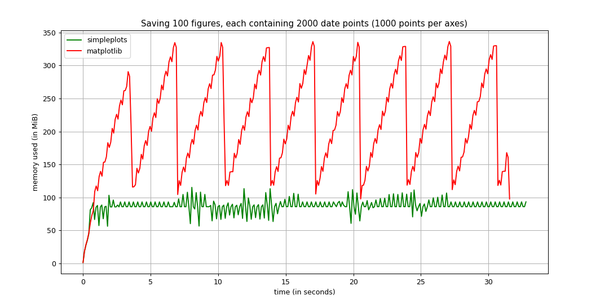
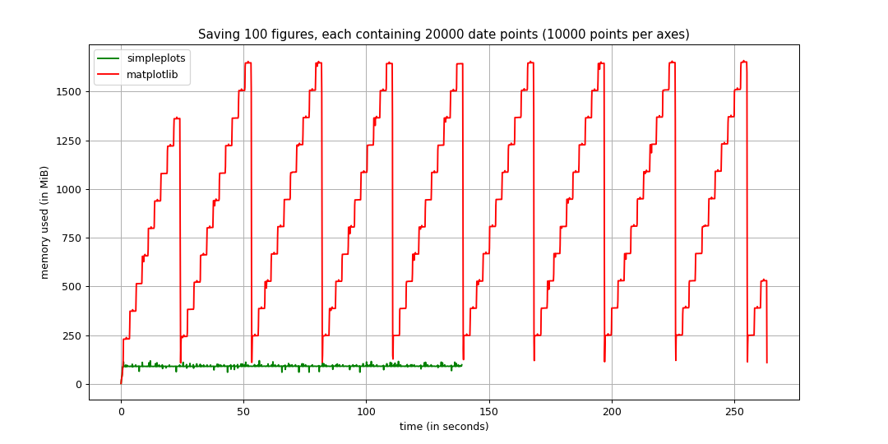

# Comparizon
This folder contains performance test results in comparizon to [matplotlib](https://github.com/matplotlib/matplotlib). Main test subjects are memory and time consumption. The data has been collected using [memory_profiler](https://github.com/pythonprofilers/memory_profiler) library.

## Additional
+ If you have found an error with testing method, or an inaccuracy, please, open an issue regarding this problem. The main objective is not to be better than matplotlib, but to optimize simpleplots. As mentioned at the main page: *The project is, obviously, not trying to compete with [matplotlib](https://github.com/matplotlib/matplotlib) in data analysis, but aims to satisfy a specific purpose of being able to create and save a large number of figures in the most efficient, yet accurate way.*
