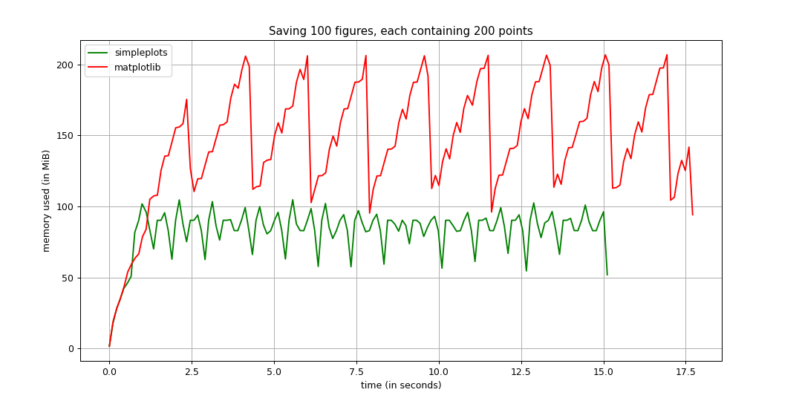
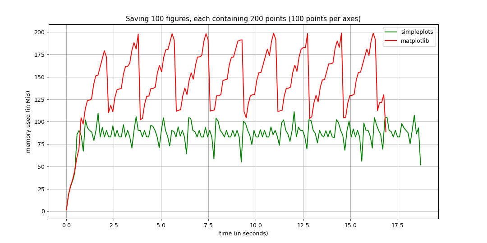
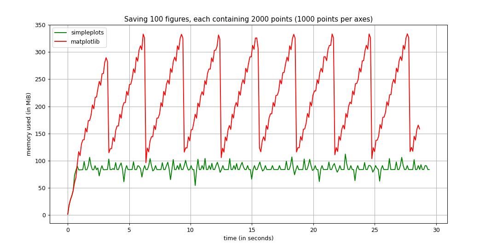
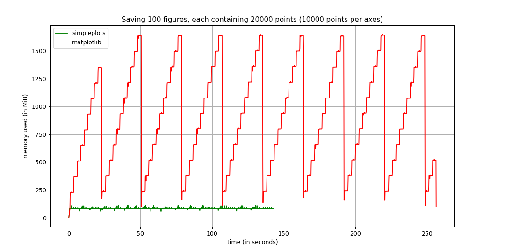

This library is created with the following idea in mind: "**If, for some reason, I need to create a lot of simple linear graphs and save their images, I don't want to worry about memory leaks. It must be easy to plot a simple 2D graph and save the figure, even if it's 100 of them!**"
# Comparizon
This folder contains performance test results in comparizon to matplotlib. Main test subjects are memory and time consumption. The data has been collected using [memory_profiler](https://github.com/pythonprofilers/memory_profiler) library.

